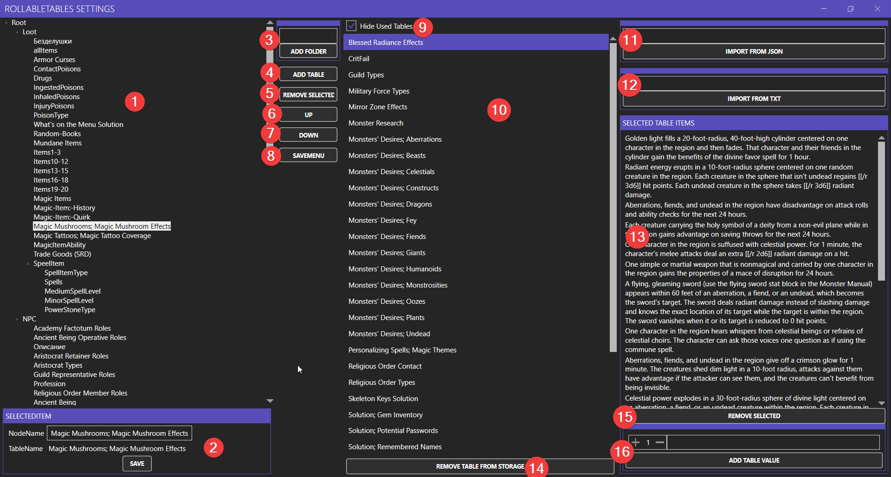

# RollableTables
App to store and use rollable tables for Tabletop role-playing games

[English](#English)

[Russian](#Russian)
# English
## Main goal to have customizable storage for rollable tables independed from VTT that you use. Feel free to delete all my data and create your own tables storage 

## Folder description

1) Main app. There you will use your tables
2) Setup app. There you can add/delete tables and setup table menu
3) DB where placed all tables. 
4) Table menu setup.(just delete both if you want only your own tables)

## Main app

1) Buttons with arrow is folders
2) Buttohs without arrow is table buttons
3) Log of rolls (didn't save between closing)

## Setup app

1) Menu tree
2) Settings for selected item from menu tree. There is you can change node name. If there are table name, that is table button else this is folder 
3) Add folder to selected folder in tree. You can add folders only to other folders if you selected table, folder will add near table.
4) Add selected table from tables list to selected folder in menu tree
5) Remove selected item(table/folder) from menu tree.
6) Move selected item up
7) Move selected item down
8) Save menu tree (don't forget save before closing app)
9) This checkbox hide tables that already added to menu
10) Tables list
11) Path to folder with tables exported from foundry. All other files will be ignored but it can take time, so will be better to check that there are only correct files. Name of table will be taken from json. Tables with name that already in db will be ignored
12) Path to folder with tables in txt. Expected format -> each line new value for table. before value you can add optional number parameter weight -> weight;tableline
13) Values from selected table (from menu tree or from tables list that was selected last)
14) Button that allow delete table from DB. Be careful, that can't be undone

# Russian
## Главная идея получить изменяемое место для хранения и использования таблиц для нри независимо от виртуального стола. Можете спокойно удалить все мои данные и собрать свой собственный набор таблиц

## Описание папки программы

1) Основное приложение. Тут вы можете непосредственно использовать таблицы
2) Приложение для настройки. Тут вы можете добавить и удалить таблицы и настроить меню основного приложения
3) Файл базы данных где хранятся таблицы.
4) Файл где хранится меню таблиц (Можете просто удалить оба файла если хотите все начать с чистого листа.)

## Основное приложение

1) Кнопки со стрелочкой это папки
2) Кнопки без стрелочки делают бросок по таблице
3) Лог бросков (не сохраняется между выходами)

## Настроечное приложение

1) Дерево меню таблиц.
2) Настройки для выбранного элемента в дереве. Здесь можно изменить имя ноды. Если есть TableName это кнопка таблицы иначе это папка.
3) Добавить папку к выбранной папке в дереве. Папку можно добавить только к другой папке, если выбрана таблица, то папка будет добавлена рядом.
4) Добавить выбранную таблицу из листа таблиц к выбранной папке в меню.
5) Удалить выбранный элемент из дерева.
6) Передвинуть выбранный элемент дерева вверх
7) Передвинуть выбранный элемент дерева вниз
8) Сохранить настройки меню. (не забывайте нажимать перед выходом из программы)
9) Этот чекбокс скрывает таблицы которые уже добавленны в меню
10) Лист таблиц из БД
11) Путь к папке с файлами в формате json экспортированным из фаундри. Все остальные файлы будут проигнорированны(но это может занять много времени, так что лучше убедиться что в папке нет ничего лишнего). Имя таблицы будет взято из файла. Таблицы с именем которые уже есть в базе будут проигнорированны.
12) Путь к папке с таблицами в формате txt. Ожидаемый формат файлов -> На каждой линии новое значение для таблицы. Перед значением можно добавить опциональный параметр веса значения -> вес;линия таблицы
13) Здесь отображаются значения выбранной таблицы (из меню или из листа таблиц, в зависимости от того что было выбранно последним)
14) Кнопка позволяющая удалить таблицу из бд. будьте внимательны, это действие нельзя отменить.